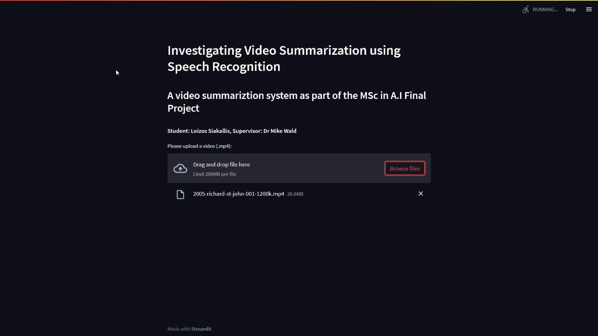

# VideoSummarizer
A video summarizer as part of my MSc in Artificial Intelligence Final Project

### Description
This project takes as an input a video, and uses it audio to produce a transcription using Google's Speech-To-Text API. It then then presents 6 summarization methods to choose and produce the summary, based on the summarization ratio provided.

### Instructions - How to install and use it
1. Download the project to a local directory
2. Install the dependencies by entering the following command into the command prompt: `pip install -r requirements.txt`
3. Run the application with *Streamlit* to use the GUI with the following command: `streamlit run video_summarizer.py`

### Video demonstrating the system's functionality
*Note: the transcription process takes the longest so skip to 1:52 where it finishes*

### Screenshots of GUI

